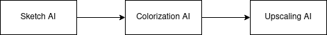
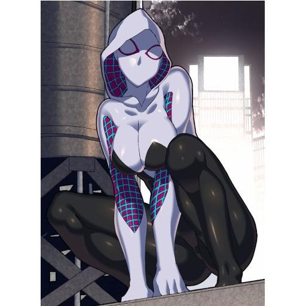
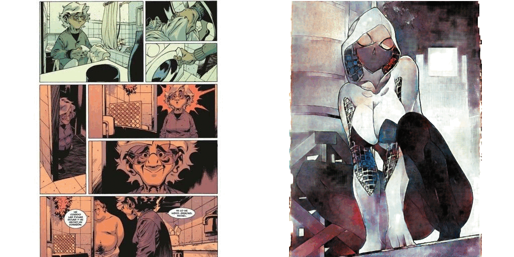

# AI_GAN_Comics_BD
## Contexte
Dans le cadre de nos études en double diplôme à l'UQAC pour le cours d'Apprentissage profond (8INF892) nous avions pour projet de créer un outil pour aider les artistes de BD. Nous voulons utiliser plusieurs modèles d'IA pour qu'on puisse partir d'un sketch de BD fait rapidement à un résultat colorié et propre. Nous avons imaginé dans un premier temps ce schéma d'utilisation d'IA.

Pour aboutir à ce projet nous avons voulu tester différent modèles de colorisations avec différents jeux de données. Nous avons donc créer notre propre jeux de données de BD en s'appuyant sur Pinterest comme source. Nous avons deux jeux de données: celui de base avec les mangas [Kaggle_manga](https://www.kaggle.com/datasets/ktaebum/anime-sketch-colorization-pair) et notre jeux de données avec les BDs [Kaggle_BD](https://www.kaggle.com/datasets/mrarmonius/bd-and-comics).

## Checkpoint
Tous les poids se trouvent sur notre google drive qu'on peut trouver sur ce [lien](https://drive.google.com/drive/folders/1JUFD0DqkY3tNxX4BgYO1Us6ITQSh9zn9?usp=share_link).

## AI_pix2pix

## AI_AttentiondeDeepPaint
Un model proposé par ktaebum.

Résultat obtenu avec 45 epochs sur le jeux de données de BD.

Une compilation de plusieurs sorties en fonction de leur référence mise en place.

### Guide utilisation rapide
- Télécharger les poids du générateur sur le lien drive
- Insérer les poids dans le dossier checkpoints
- Mettez votre image sketch dans data/test et votre image de référence dans data/reference
- Executez le script python colorize.py avec en argument le nom du test et le nom de la référence.

## Upscale